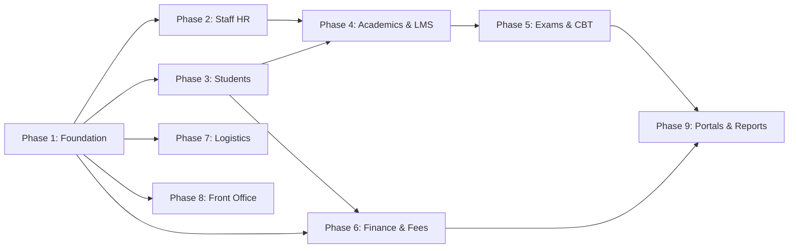

# 📘 School Management System (SMS) - Master Dummy Data Seeding & Screen Guide

Welcome to the **Master Seeding & Workflow Guide** for the School Management System (SMS). This document provides step-by-step instructions on how to seed high-quality dummy data across **all 100+ frontend screens** and **70+ backend database tables** in exact relational sequence.

---

## 🎯 1. Single-Tenant Auto-Propagation Mechanism

The entire seed script ([`seed_master_100_screens_all_modules.sql`](file:///c:/Users/ADV/source/repos/BilalAbdullah1/SMS/seed_master_100_screens_all_modules.sql)) is driven by **one single variable** at the top of the PL/pgSQL block:

```sql
DO $$
DECLARE
    -- Configure your target tenant UUID here:
    v_tenant_id UUID := '00000000-0000-0000-0000-000000000000';
    v_school_name TEXT := 'Excellence International School';
    v_school_code TEXT := 'EXCELLENCE';
```

### 💡 How It Works:
- If you want to seed data for a new campus or specific tenant, **just change `v_tenant_id` at the top of the script**.
- The script automatically checks if the tenant exists (and inserts it if missing), and then **binds that exact `v_tenant_id` to every single downstream table** (Chart of Accounts, Roles, Users, Academic Years, Classes, Sections, Subjects, Staff, Students, Fees, Exams, Transport, Hostel, Inventory, Library, etc.).
- **Zero Orphaned Records & Zero Foreign Key Violations**: Every relationship (Students -> Enrollments -> Classes -> Sections -> Academic Years) uses deterministic UUIDs so the entire hierarchy stays 100% interconnected.

---

## 🔑 2. Default Login Credentials for All Roles

All seeded user accounts are active and pre-configured with the default password: **`Admin@123`**.

| Role Name | Login Email | Username / Designation | Assigned User ID |
|---|---|---|---|
| **SuperAdmin / Admin** | `admin@excellence.edu.pk` | Bilal Ahmad Admin | `c0000001-0000-0000-0000-000000000001` |
| **Principal** | `principal@excellence.edu.pk` | Dr. Imran Khan Principal | `c0000001-0000-0000-0000-000000000010` |
| **Teacher (Math HOD)** | `hassan@excellence.edu.pk` | Mr. Hassan Raza | `c0000001-0000-0000-0000-000000000002` |
| **Teacher (Physics)** | `ayesha@excellence.edu.pk` | Ms. Ayesha Siddiqui | `c0000001-0000-0000-0000-000000000003` |
| **Teacher (English)** | `tariq@excellence.edu.pk` | Mr. Tariq Mahmood | `c0000001-0000-0000-0000-000000000004` |
| **Accountant (Finance)** | `rehan@excellence.edu.pk` | Rehan Malik Accountant | `c0000001-0000-0000-0000-000000000005` |
| **Librarian** | `zara@excellence.edu.pk` | Zara Noor Librarian | `c0000001-0000-0000-0000-000000000006` |
| **Parent (Tariq)** | `parent.tariq@gmail.com` | Tariq Mahmood Parent | `c0000001-0000-0000-0000-000000000007` |
| **Parent (Farooq)** | `parent.farooq@gmail.com` | Farooq Khan Parent | `c0000001-0000-0000-0000-000000000008` |
| **Student (Usman)** | `usman@excellence.edu.pk` | Muhammad Usman Student | `c0000001-0000-0000-0000-000000000009` |

---

## 🧭 3. 9-Phase Relational Seeding Flow & Screen Directory

The database tables and their linked frontend screens are organized in chronological order:



---

### 🔹 Phase 1: Core Foundation & Master Setup
| # | Backend Table | C# Entity Model | Frontend Route / Screen | Key Seeded Data |
|---|---|---|---|---|
| 1 | `tenants` | `Tenant` | `/Tenants` | 10 Campuses (Excellence Main, Beacon, City Grammar, Islamabad, etc.) |
| 2 | `roles` | `Role` | `/Roles` | 10 Roles (SuperAdmin, Admin, Principal, Accountant, Teacher, etc.) |
| 3 | `permissions` & `role_permissions` | `Permission`, `RolePermission` | `/PermissionsMatrix` | Full RBAC permissions catalog mapped across modules |
| 4 | `users` | `User` | `/UserManagement`, `/signin` | 10 User logins with passwords & phone numbers |
| 5 | `academic_years` | `AcademicYear` | `/AcademicYears` | 10 Sessions (2020 to 2029, active: `2025-2026`) |
| 6 | `classes` | `SchoolClass` | `/Classes` | 10 Grades (`Playgroup`, `Nursery`, `KG`, `Class 1` to `Class 10th/12th`) |
| 7 | `sections` | `Section` | `/Sections` | 10 Sections (`Section A Jinnah`, `Section B Iqbal`, etc.) |
| 8 | `subjects` | `Subject` | `/Subjects` | 10 Subjects (`Math`, `Physics`, `CS`, `Urdu`, etc.) with elective groups |
| 9 | `class_subjects` | `ClassSubject` | `/ClassSubject` | 10 Class-Subject mappings with total & passing marks |
| 10 | `chart_of_accounts` | `ChartOfAccount` | `/ChartOfAccounts`, `/GeneralLedger` | **3-Tier Tree**: Level 1 Heads, Level 2 Sub-Heads & Level 3 Ledgers |

---

### 🔹 Phase 2: Human Resources, Faculty & Staff
| # | Backend Table | C# Entity Model | Frontend Route / Screen | Key Seeded Data |
|---|---|---|---|---|
| 11 | `staff` | `Staff` | `/StaffDirectory` | 10 Staff profiles (Principal, HODs, Teachers, Accountant, Librarian) |
| 12 | `staff_attendance` | `StaffAttendance` | `/StaffAttendance`, `/BiometricDevices` | 10 Attendance records with check-in/out times, GPS coordinates & late flags |
| 13 | `leave_applications` | `LeaveApplication` | `/StaffLeaveApplication`, `/LeaveApprovals` | Staff leave requests (Sick, Casual, Urgent) with approvals |
| 14 | `salary_slips` | `SalarySlip` | `/PayrollSlips`, `/SalarySlipsManager` | 10 Salary slips with allowances, tax, PF, and net salary calculations |
| 15 | `staff_loans` | `StaffLoan` | `/StaffLoans` | 3 Active staff loans with EMI installments & remaining balances |
| 16 | `staff_appraisals` | `StaffAppraisal` | `/StaffAppraisals` | 3 Performance reviews with ratings, increments, and Teacher of the Month |
| 17 | `staff_clearances` | `StaffClearance` | `/StaffClearance` | Exit clearance record with department handovers |
| 18 | `staff_chat_messages` | `StaffChatMessage` | `/StaffChat` | Departmental chat messages across channels |

---

### 🔹 Phase 3: Student Lifecycle, Admissions, Parents & Portals
| # | Backend Table | C# Entity Model | Frontend Route / Screen | Key Seeded Data |
|---|---|---|---|---|
| 19 | `admission_enquiries` | `AdmissionEnquiry` | `/AdmissionEnquiries`, `/PublicAdmissionPortal` | 5 Admission inquiries with status tracking (Enquiry, Scheduled, Admitted) |
| 20 | `students` | `Student` | `/students` | 10 Student profiles with B-Form, emergency contacts, blood group, house |
| 21 | `student_enrollments` | `StudentEnrollment` | `/StudentEnrollments`, `/StudentPromotions` | 10 Active enrollments mapped to Class, Section, and Roll Numbers |
| 22 | `student_subjects` | `StudentSubject` | `/ClassSubject` | Student elective selections (Biology vs Computer Science) |
| 23 | `student_medical_records` | `StudentMedicalRecord` | `/students` (Profile Drawer) | Medical details (allergies, chronic conditions, doctor details) |
| 24 | `student_behavior_logs` | `StudentBehaviorLog` | `/StudentBehaviorLogs` | Merit & demerit behavior logs with point adjustments |
| 25 | `student_attendance` | `StudentAttendance` | `/StudentAttendance`, `/ProxyAttendance` | Daily classroom attendance logs with check-in/out times & late fines |
| 26 | `alumni_profiles` | `AlumniProfile` | `/AlumniDirectory` | Graduated alumni records with university & career details |

---

### 🔹 Phase 4: Academics, Timetable & LMS
| # | Backend Table | C# Entity Model | Frontend Route / Screen | Key Seeded Data |
|---|---|---|---|---|
| 27 | `timetable_periods` | `TimetablePeriod` | `/Timetable`, `/TeacherTimetable` | Weekly timetable period slots with room & teacher assignments |
| 28 | `lesson_plans` | `LessonPlan` | `/LessonPlanning` | Weekly lesson plans with objectives & completion percentages |
| 29 | `study_materials` | `StudyMaterial` | `/StudyMaterialRepository` | Downloadable lecture notes, past papers, and video links |
| 30 | `live_classes` | `LiveClass` | `/LiveClassesManager` | Scheduled Zoom/Meet live virtual sessions |
| 31 | `homeworks` | `Homework` | `/HomeworkManagement`, `/StudentHomeworkPortal` | Homework assignments with deadlines and max marks |
| 32 | `homework_submissions` | `HomeworkSubmission` | `/HomeworkSubmissions` | Student homework submissions with marks & teacher feedback |
| 33 | `student_diaries` | `StudentDiary` | `/StudentDiaryManager` | Classroom daily diary remarks by class teachers |
| 34 | `house_point_logs` | `HousePointLog` | `/HouseSystemDashboard` | House point awards (Jinnah, Iqbal, Sir Syed, Razi) |

---

### 🔹 Phase 5: Examinations, Question Banks & Online CBT
| # | Backend Table | C# Entity Model | Frontend Route / Screen | Key Seeded Data |
|---|---|---|---|---|
| 35 | `grading_scales` | `GradingScale` | `/GradingScales` | 7 Grading scale criteria (A+, A, B+, B, C, D, F with GPAs & badges) |
| 36 | `exam_setups` | `ExamSetup` | `/ExamSetups` | Mid-Term 2025 and Final Term Mock 2026 setups |
| 37 | `exam_schedules` | `ExamSchedule` | `/ExamSchedules`, `/AdmitCardGenerator` | Exam papers with date, timings, room number, and invigilator |
| 38 | `exam_marks` | `ExamMark` | `/MarksEntryDashboard` | Marks entries (Theory, Practical, Assignment, Total Obtained) |
| 39 | `exam_results` | `ExamResult` | `/ReportCardManager`, `/reports/report-cards` | Result cards with total marks, percentage, grade, and GPA |
| 40 | `question_banks` | `QuestionBank` | `/QuestionBank` | Multiple-choice questions with options, explanations & difficulty |
| 41 | `online_exams` | `OnlineExam` | `/OnlineExams`, `/TakeOnlineExam` | Online CBT exam test setups with timers & shuffle options |
| 42 | `student_exam_attempts` | `StudentExamAttempt` | `/StudentCBT` | Student CBT test submissions with auto-graded scores |

---

### 🔹 Phase 6: Finance, Billing & Accounting
| # | Backend Table | C# Entity Model | Frontend Route / Screen | Key Seeded Data |
|---|---|---|---|---|
| 43 | `fee_types` | `FeeType` | `/FeeSetup` | 10 Fee Heads (Tuition, Admission, Lab, Library, Exam, Transport, etc.) |
| 44 | `fee_structures` | `FeeStructure` | `/FeeStructures` | Class-wise fee packages linked to fee types & academic years |
| 45 | `fee_concessions` | `FeeConcession` | `/FeeConcessions` | Concession rules (Kinship 25%, Merit 50%, Staff Ward 100%) |
| 46 | `fee_challans` | `FeeChallan` | `/FeeChallans`, `/FeePaymentHistory` | Monthly fee challans with due dates & status (Paid, Unpaid, Partial) |
| 47 | `fee_challan_details` | `FeeChallanDetail` | `/reports/fee-voucher` | Itemized fee head breakdown lines per challan |
| 48 | `fee_payments` | `FeePayment` | `/FeeChallans`, `/reports/daily-collection` | Paid fee receipt transactions (Bank Transfer, Cash, Card POS) |
| 49 | `school_expenses` | `SchoolExpense` | `/SchoolExpensesTracker`, `/ExpenseLogs` | School expense vouchers (Electricity bill, Generator diesel, Lab reagents) |

---

### 🔹 Phase 7: Campus Logistics & Facility Management
| # | Backend Table | C# Entity Model | Frontend Route / Screen | Key Seeded Data |
|---|---|---|---|---|
| 50 | `transport_vehicles` | `TransportVehicle` | `/TransportSetup` | 5 Fleet vehicles (Coasters, Hiace Vans, Buses) with driver contacts |
| 51 | `transport_routes` | `TransportRoute` | `/TransportRoutes` | 3 Route paths with stops and monthly fare rates |
| 52 | `student_transport` | `StudentTransport` | `/StudentTransport` | Student bus route subscriptions |
| 53 | `hostel_rooms` | `HostelRoom` | `/HostelSetup` | 3 Hostel rooms (Double, Triple, Single Suite) with monthly fees |
| 54 | `hostel_allocations` | `HostelAllocation` | `/HostelAllocations` | Student hostel room bed allocations |
| 55 | `inventory_items` | `InventoryItem` | `/StockCatalog` | 5 Inventory stock items (Markers, Paper Reams, Chairs, Projectors) |
| 56 | `inventory_transactions` | `InventoryTransaction` | `/StockLedger` | Inventory purchase and departmental issuance logs |
| 57 | `library_books` | `LibraryBook` | `/BookCatalog` | 5 Books across Math, Physics, CS, Literature with ISBNs |
| 58 | `book_issuances` | `BookIssuance` | `/IssueBooks`, `/LibraryFines` | Book issue & return records with fine tracking |

---

### 🔹 Phase 8: Front Office, Governance & Communications
| # | Backend Table | C# Entity Model | Frontend Route / Screen | Key Seeded Data |
|---|---|---|---|---|
| 59 | `visitors` | `Visitor` | `/VisitorsLog` | Visitor gate passes with check-in/out times, ID cards & hosts |
| 60 | `ptm_slots` | `PtmSlot` | `/PtmScheduler`, `/PtmSlots` | Parent-Teacher Meeting consultation slots |
| 61 | `notices` | `Notice` | `/DigitalNoticeBoard`, `/Noticeboard` | Broadcast notice board announcements (Sports Gala, Date Sheet, Fee) |
| 62 | `helpdesk_tickets` | `HelpdeskTicket` | `/HelpdeskTickets` | Support tickets across Facilities, Academics, Fee Billing |
| 63 | `feedback_suggestions` | `FeedbackSuggestion` | `/FeedbackSuggestions` | Anonymous suggestions with admin response |
| 64 | `event_calendar_items` | `EventCalendarItem` | `/EventCalendar` | School event milestones (Science Exhibition, Sports Gala, PTM) |
| 65 | `holidays` | `Holiday` | `/HolidayCalendar` | National and academic holidays (Pakistan Day, Eid, Summer Break) |
| 66 | `audit_logs` | `AuditLog` | `/SystemAudits`, `/FinancialAuditLogs` | Change tracking audit trails with JSON old/new values |

---

### 🔹 Phase 9: Reports & Portals Validation
| # | Feature / Screen | Frontend Route | Underlying Seeded Data Sources |
|---|---|---|---|
| 67 | Student ID Cards Generator | `/IDCardGenerator`, `/reports/student-id-cards` | Pulled from `students` and `student_enrollments` |
| 68 | School Leaving Certificate (SLC) | `/TransferCertificate`, `/reports/slc-certificate` | Pulled from `students` and `classes` |
| 69 | Fee Defaulters Tracker | `/FeeDefaulters`, `/reports/fee-defaulters` | Pulled from `fee_challans` (Status = 'Unpaid' or 'Partial') |
| 70 | Examination Broadsheet & Cards | `/reports/broadsheet`, `/reports/report-cards` | Pulled from `exam_results` and `exam_marks` |
| 71 | Trial Balance, Balance Sheet, P&L | `/reports/trial-balance`, `/reports/balance-sheet`, `/reports/profit-loss` | Calculated from `chart_of_accounts`, `fee_payments`, `school_expenses` |
| 72 | Parent Portal Dashboard | `/parent-dashboard`, `/ApplyLeave`, `/FeePaymentHistory` | Filtered for linked Parent User (`parent.tariq@gmail.com`) |
| 73 | Student Portal Dashboard | `/student-dashboard`, `/StudentHomeworkPortal`, `/StudentCBT` | Filtered for Student User (`usman@excellence.edu.pk`) |
| 74 | Staff & Faculty Dashboard | `/staff-dashboard` | Filtered for Teacher User (`hassan@excellence.edu.pk`) |
| 75 | Executive Master Dashboard | `/ExecutiveMasterDashboard`, `/dashboard` | Aggregates all KPI cards from the active seeded tenant |

---

## ⚡ 4. How to Execute the Master Seed Script

1. Open your PostgreSQL query tool (such as **pgAdmin**, **DBeaver**, **VS Code SQL Tools**, or **psql**).
2. Connect to your SMS database (`SMS_DB` / `sms_development`).
3. Open the generated script: [`seed_master_100_screens_all_modules.sql`](file:///c:/Users/ADV/source/repos/BilalAbdullah1/SMS/seed_master_100_screens_all_modules.sql).
4. *(Optional)* If you want to seed for a custom tenant, replace `v_tenant_id` at line 14 with your custom GUID.
5. Execute the script (`F5` or **Run**).
6. Verify output in the Messages tab:
   ```text
   =======================================================
   🚀 Starting SMS Master Seed for Tenant: Excellence International School (00000000-0000-0000-0000-000000000000)
   =======================================================
   ...
   =======================================================
   ✅ SMS Master Seed Complete! All 100+ screens & 70+ tables seeded successfully for tenant: 00000000-0000-0000-0000-000000000000
   =======================================================
   ```
7. Start your frontend (`npm run dev`) and sign in with `admin@excellence.edu.pk` / `Admin@123` to explore all seeded screens!
